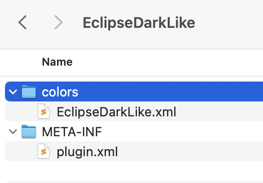

Your request 5142134 has been updated. To add additional comments, reply to this email.
----------------------------------------------

Jetbrains Marketplace Support, May 12, 2023, 12:03 GMT+3

Hello,

Thank you for the details! I have consulted with our devs, and they say this is considered as a source code in your case (that you can provide the link to):

 

Best regards,
JetBrains

----------------------------------------------

William Gray, May 11, 2023, 16:29 GMT+3

Color schemes dont really have source code tho... its just packaging an xml file into a jar, so the "code" if you can call it that, is distributed directly with the "plugin". There are no java class files or anything else that gets compiled just resources. Idea directly imports and exports these as plugins...

more directly: "source code" as defined in the eclipse public license 2.0 is "the form of a program preferred for making modifications, including but not limited to software source code, documentation source, and configuration files". Well, the "preferred form" for modifying intellij color schemes is in plugin form, thus, there is nothing extra to link as the source code and the binary are the same file.

Thanks

Wagyourtail

----------------------------------------------

Jetbrains Marketplace Support, May 11, 2023, 13:25 GMT+3

Hello William,

Yes, it is obligatory to provide a valid source code link if you are distributing your plugin as open-source software on JetBrains Marketplace. One of the defining characteristics of open-source software is that its source code is made freely available to users.

It works the same way for scheme plugins as for any other plugins. You can host your source code in repositories like GitHub, GitLab or simply on cloud drives like Google drive.

Best regards,
JetBrains

----------------------------------------------

William Gray, May 11, 2023, 01:29 GMT+3

Hi,

I'm trying to post an update to my color scheme, https://plugins.jetbrains.com/plugin/17464-eclipsedarklike-color-scheme, but it seems like source code is now a required field for oss licenses, how does this work for idea color schemes as they don't really have git repos seeing as I'm just exporting them from Idea?

Thanks,
William Gray

--------------------------------
This email is a service from JetBrains Marketplace.